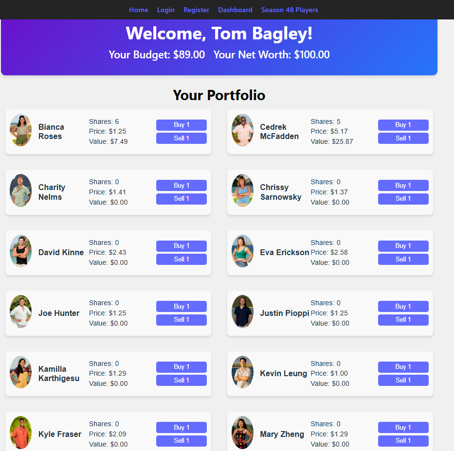

# Survivor Season 48 Interactive Stock Game

## Table of Contents
1. [Introduction](#introduction)
2. [Project Contents](#project_contents)

## Introduction
Welcome to the Survivor Season 48 Stock Game! In this interactive experience, each player begins with $100 to invest in Survivor contestants. You can choose to put all your stock in one contestant or spread your investments across multiple players.

Each week, as contestants are eliminated from the show, any stock you’ve invested in them will be lost. Survivor contestants with higher investments will see their stock prices rise, making them more expensive to buy—but also more valuable.

The ultimate goal? Outplay, outlast, and outwit other players to end the game with the highest portfolio value. May the best strategist win!

The project is still under development but will be up and running for the start of the season.

## Project Contents 
1. **Excel layout folwder**:
   - **'Survivor Start.xlsx'**: An excel framework to see how the game is played and experiment with different situations.
   -**Sub Buuton1_Click()**: This is the VBA script that helps the excel framework run.
2. **Client folder**: The client folder houses all the frontend code for the application. It includes context management, assets, components, pages, and configuration files for the React-based interface.
   - **context folder**: userContext.jsx: Manages user-related global state, such as authentication status and user information, using React Context API.
        -**userContext.jsx**:
   - **node_modules folder**: Contains all the dependencies and libraries installed for the project via npm, such as React, Vite, and other required packages.
   - **public folder**: Includes public assets and files that don't require processing by the build system.
        - **vite**: Contains Vite-specific configurations or assets used for development and production builds.
   - **src folder**: The src folder is the main working directory for the application's source code.
        - **assets folder**: Contains static assets like images, logos, or other files used in the application.
            - **react**: Placeholder for any React-related assets or resources.
        - **components folder**: Reusable UI components that are shared across the application.
            - **Navbar.jsx**: Navbar.jsx: The navigation bar component for the app, providing links to different pages.
        - **pages folder**: Contains the individual pages for the application.
            - **Dashboard.jsx**: The dashboard page, displaying the user's portfolio and overall game statistics.
            - **Home.jsx**: The homepage, introducing users to the Survivor Stock Game.
            - **Login.jsx**: The login page, allowing users to authenticate and access their accounts.
            - **Players.jsx**: A page displaying the Survivor contestants and their current stock prices.
            - **Register.jsx**: The registration page for creating a new user account.
        - **App.css**: Contains global styles for the application.
        - **App.jsx**: The root component that defines the overall structure of the application and sets up routing between pages.
        - **inded.css**: A global stylesheet used to define basic styling, such as resetting or customizing default styles.
        - **main.jsx**: The entry point for the React application, rendering the App.jsx component to the DOM.
   - **eslint.config**: Configuration file for ESLint, ensuring code quality and enforcing consistent coding standards.
   - **index.html**: The main HTML file for the application. It serves as the entry point for the React app during development and production builds.
   - **package.json**: Lists the project's dependencies, scripts, and metadata. It is used by npm to manage the project.
   - **package-lock.json**: Automatically generated file that locks the versions of dependencies to ensure consistent installs across environments.
   - **vite.config**: Configuration file for Vite, the build tool used in this project. It manages settings like plugins, server options, and build output.

3. **Sever folder**: The server folder contains the backend code for the application, including API endpoints, authentication logic, and database models.
   - **controllers folder**: 
        -**authControllers.js**: authControllers.js: Handles user authentication logic, such as login, registration, and token generation.
   - **helpers folder**: 
        - **auth.js**: Contains helper functions related to authentication, such as token validation and middleware for protected routes.
   - **models folder**: 
        - **survivor_contestants.js**: Defines the schema and model for Survivor contestants, including their stock price and other attributes.
        - **user.js**: Defines the schema and model for users, including their portfolio, email, and other personal information.
   - **node_modules folder**: Contains all dependencies and libraries installed for the backend via npm, such as Express, bcrypt, and JWT.
   - **routes folder**:
        - **authRoutes**: Defines the API routes for authentication-related operations, such as /login, /register
   - **index.js**: The entry point for the backend server. Configures the Express server, connects to the database, and sets up API routes.
   - **package.json**: Lists the backend project's dependencies, scripts, and metadata. It is used by npm to manage the server project.
   - **package-lock.json**: Automatically generated file that locks the versions of dependencies to ensure consistent installs across environments.

   
